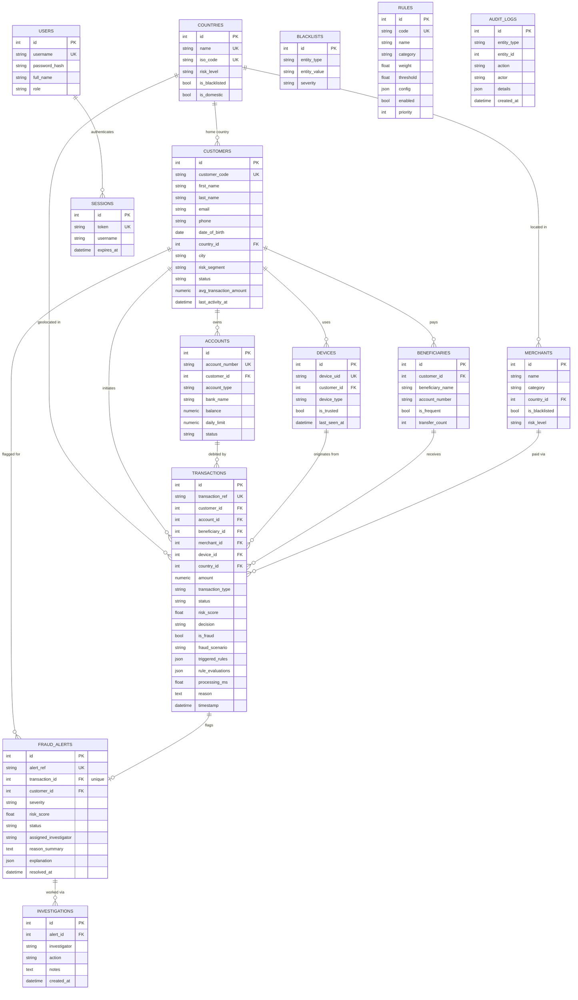

# Database Schema

## Overview

The platform persists all state in **PostgreSQL**, accessed through
SQLAlchemy's ORM (`sqlalchemy.orm.DeclarativeBase`). Every table is defined as
a single `Base` subclass under `backend/app/models/`, one file per table.
Tables are created via `Base.metadata.create_all(bind=engine)` on application
startup (`backend/app/seed.py: run_seed()`) — this is **non-destructive**: it
creates any table that does not yet exist but never drops or rewrites an
existing one. Reference data (countries, merchants, blacklists, ~100 customer
profiles with their accounts/devices/beneficiaries, the fraud rule catalog,
and two demo users) is then seeded idempotently on top.

There is no separate ORM migration framework (e.g. Alembic) in this repo;
schema evolution to date has been additive — for example, the
`rule_evaluations` and `processing_ms` columns on `transactions` (see below)
were added directly as new columns on the `Transaction` model rather than by
altering or reshaping any existing column, so `create_all()` picks them up on
any fresh database. On a database that already has the `transactions` table
from before these columns existed, they would need an explicit additive
column migration (e.g. `ALTER TABLE transactions ADD COLUMN ...`) since
`create_all()` only creates missing tables, not missing columns on existing
tables — the model and seed code do not currently perform that step
automatically.

## Entity-Relationship Diagram

## Table Reference

### `customers` (`app/models/customer.py`)

Master record for each bank customer, and the anchor for behavioral baselining
(average transaction amount, typical active hours) used throughout the rule
engine.

| Column | Type | Notes |
|---|---|---|
| `id` | `int` | Primary key |
| `customer_code` | `String(20)` | Unique, indexed |
| `first_name`, `last_name` | `String(60)` | |
| `email` | `String(120)` | |
| `phone` | `String(20)` | |
| `date_of_birth` | `Date` | |
| `gender` | `String(10)` | |
| `city` | `String(80)` | Indexed |
| `state` | `String(80)` | |
| `country_id` | `int` | FK -> `countries.id` |
| `home_latitude`, `home_longitude` | `Float` | |
| `occupation` | `String(80)` | |
| `annual_income` | `Numeric(14,2)` | |
| `account_open_date` | `Date` | |
| `risk_segment` | `String(20)` | Default `LOW`, indexed |
| `status` | `String(20)` | Default `ACTIVE`, indexed (`ACTIVE`/`DORMANT`/`CLOSED`/`SUSPENDED`) |
| `kyc_level` | `String(20)` | Default `FULL` |
| `avg_transaction_amount` | `Numeric(14,2)` | Baseline used by `AMOUNT_ANOMALY` rule |
| `common_login_hour_start`/`_end` | `int` | Defaults 8 / 22; drives `ODD_HOUR_ACTIVITY` rule |
| `last_activity_at` | `DateTime(tz)` | Nullable; updated on every transaction |
| `created_at` | `DateTime(tz)` | Server default `now()` |

Relationships: belongs to one `Country`; has many `Account`, `Device`,
`Beneficiary` (all `cascade="all, delete-orphan"`). Has a computed
`full_name` property (not a column).

### `accounts` (`app/models/account.py`)

Bank accounts belonging to a customer; the transaction's debited account.

| Column | Type | Notes |
|---|---|---|
| `id` | `int` | PK |
| `account_number` | `String(20)` | Unique, indexed |
| `customer_id` | `int` | FK -> `customers.id`, indexed |
| `account_type` | `String(20)` | Default `SAVINGS` |
| `bank_name` | `String(80)` | |
| `ifsc_code` | `String(15)` | |
| `balance` | `Numeric(14,2)` | Default 0 |
| `daily_limit` | `Numeric(14,2)` | Default 100000 |
| `status` | `String(20)` | Default `ACTIVE` |
| `opened_at` | `Date` | |
| `created_at` | `DateTime(tz)` | Server default `now()` |

Relationship: belongs to `Customer`.

### `devices` (`app/models/device.py`)

Devices a customer has transacted from; a transaction from an unrecognized
`device_uid` triggers the `NEW_DEVICE` rule.

| Column | Type | Notes |
|---|---|---|
| `id` | `int` | PK |
| `device_uid` | `String(64)` | Unique, indexed |
| `customer_id` | `int` | FK -> `customers.id`, indexed |
| `device_type` | `String(20)` | Default `MOBILE` (`MOBILE`/`DESKTOP`/`ATM_TERMINAL`/`POS_TERMINAL`) |
| `os` | `String(40)` | |
| `is_trusted` | `bool` | Default `True` |
| `first_seen_at` | `DateTime(tz)` | Server default `now()` |
| `last_seen_at` | `DateTime(tz)` | Server default `now()`; updated on reuse |

Relationship: belongs to `Customer`. New, never-seen devices are created
automatically as a side effect of `TransactionEngine._apply_side_effects()`.

### `beneficiaries` (`app/models/beneficiary.py`)

Payees a customer has sent (or is sending) money to; backs the
`NEW_BENEFICIARY`, `MONEY_MULE`, and `TRANSACTION_SPLITTING` rules.

| Column | Type | Notes |
|---|---|---|
| `id` | `int` | PK |
| `customer_id` | `int` | FK -> `customers.id`, indexed |
| `beneficiary_name` | `String(120)` | |
| `account_number` | `String(20)` | |
| `ifsc_code` | `String(15)` | |
| `bank_name` | `String(80)` | |
| `relationship_type` | `String(40)` | Default `OTHER` |
| `is_frequent` | `bool` | Default `False`; flips true once `transfer_count >= 3` |
| `transfer_count` | `int` | Default 0; incremented on every transaction to this beneficiary |
| `added_at` | `DateTime(tz)` | Server default `now()` |

Relationship: belongs to `Customer`.

### `merchants` (`app/models/merchant.py`)

Merchant catalog used for card/UPI transactions; blacklisted merchants back
the `BLACKLISTED_MERCHANT` rule.

| Column | Type | Notes |
|---|---|---|
| `id` | `int` | PK |
| `name` | `String(150)` | Indexed |
| `category` | `String(80)` | |
| `city` | `String(80)` | |
| `country_id` | `int` | FK -> `countries.id` |
| `is_blacklisted` | `bool` | Default `False` |
| `risk_level` | `String(20)` | Default `LOW` |

Relationship: belongs to `Country` (plain `relationship()`, no back-reference
declared on `Country`).

### `countries` (`app/models/country.py`)

Reference table of countries, used to flag foreign/high-risk geolocation.

| Column | Type | Notes |
|---|---|---|
| `id` | `int` | PK |
| `name` | `String(100)` | Unique, indexed |
| `iso_code` | `String(3)` | Unique |
| `risk_level` | `String(20)` | Default `LOW` |
| `is_blacklisted` | `bool` | Default `False` |
| `is_domestic` | `bool` | Default `False` (only `India` is seeded as domestic) |

Relationship: has many `Customer` (`back_populates="country"`).

### `blacklists` (`app/models/blacklist.py`)

Generic denylist of known-bad entities (merchants, IP addresses, and
potentially devices/accounts/countries/beneficiaries per
`BlacklistEntityType`), keyed by type + value rather than a foreign key, so it
can reference any entity kind uniformly.

| Column | Type | Notes |
|---|---|---|
| `id` | `int` | PK |
| `entity_type` | `String(20)` | Indexed (e.g. `MERCHANT`, `IP_ADDRESS`) |
| `entity_value` | `String(150)` | Indexed (e.g. merchant name, IP string) |
| `reason` | `Text` | |
| `severity` | `String(20)` | Default `HIGH` |
| `added_at` | `DateTime(tz)` | Server default `now()` |

No SQLAlchemy relationships/foreign keys — it is looked up by
`entity_type`/`entity_value` match at scoring time (see
`BLACKLISTED_IP` / `BLACKLISTED_MERCHANT` rules).

### `rules` (`app/models/rule.py`)

The configurable fraud-rule catalog. Each row is one detection rule the rule
engine evaluates; `code` maps to a Python evaluator function in
`app/services/rule_engine.py: RULE_EVALUATORS`.

| Column | Type | Notes |
|---|---|---|
| `id` | `int` | PK |
| `code` | `String(60)` | Unique, indexed (e.g. `AMOUNT_ANOMALY`, `IMPOSSIBLE_TRAVEL`) |
| `name` | `String(150)` | Display name |
| `description` | `Text` | |
| `category` | `String(40)` | |
| `weight` | `Float` | Points added to the risk score when triggered |
| `threshold` | `Float` | Nullable |
| `config` | `JSON` | Per-rule tunables (e.g. `multiplier`, `amount_threshold`, `count`, `window_seconds`) |
| `enabled` | `bool` | Default `True`; togglable from the Rules page |
| `priority` | `int` | Default 100; evaluation order |
| `created_at` / `updated_at` | `DateTime(tz)` | `updated_at` has an `onupdate` callback |

No SQLAlchemy relationships. On every startup, `seed.py: sync_rules()` inserts
new rule definitions from `rule_seed_data.py` and refreshes their scoring
fields, while preserving whatever `enabled` state an admin has already set.

### `transactions` (`app/models/transaction.py`)

The central fact table — one row per transaction processed by
`TransactionEngine.process()`, whether generated organically or injected as
fraud.

| Column | Type | Notes |
|---|---|---|
| `id` | `int` | PK |
| `transaction_ref` | `String(30)` | Unique, indexed (e.g. `TXN-...`) |
| `customer_id` | `int` | FK -> `customers.id`, indexed |
| `account_id` | `int` | FK -> `accounts.id`, indexed |
| `beneficiary_id` | `int` \| null | FK -> `beneficiaries.id` |
| `merchant_id` | `int` \| null | FK -> `merchants.id` |
| `device_id` | `int` \| null | FK -> `devices.id` |
| `country_id` | `int` | FK -> `countries.id` |
| `amount` | `Numeric(14,2)` | Indexed |
| `currency` | `String(5)` | Default `INR` |
| `transaction_type` | `String(20)` | Indexed (`UPI`, `ATM`, `DEBIT_CARD`, `CREDIT_CARD`, `NEFT`, `RTGS`, `IMPS`) |
| `beneficiary_name_snapshot` | `String(120)` \| null | Point-in-time copy of the beneficiary name |
| `merchant_name_snapshot` | `String(150)` \| null | Point-in-time copy of the merchant name |
| `latitude`, `longitude` | `Float` | |
| `city` | `String(80)` | |
| `ip_address` | `String(45)` | |
| `status` | `String(20)` | Default `PENDING`, indexed (`APPROVED`/`REVIEW`/`OTP_PENDING`/`BLOCKED`/`PENDING`) |
| `risk_score` | `Float` | Default 0, indexed; 0-100 |
| `decision` | `String(20)` | Default `APPROVE` (`APPROVE`/`REVIEW`/`OTP_VERIFICATION`/`BLOCK`) |
| `is_fraud` | `bool` | Default `False`, indexed; true for injector-generated transactions |
| `fraud_scenario` | `String(60)` \| null | Which of the 17 injected scenarios produced this row, if any |
| `triggered_rules` | `JSON` | **Dict** of only the rules that fired, e.g. `{"rules": ["LARGE_AMOUNT", "NEW_DEVICE"]}` |
| `rule_evaluations` | `JSON` | **List** — full pass/fail verdict for *every* enabled rule (`code`, `name`, `category`, `weight`, `triggered`, `detail`); powers the live rule execution panel in the Transaction Simulator |
| `processing_ms` | `Float` | Default 0; wall-clock time (`time.perf_counter()`) for the full context-build -> rule -> risk -> explain pipeline, in milliseconds |
| `reason` | `Text` | Default `""`; one-line human-readable summary from the explanation engine |
| `timestamp` | `DateTime(tz)` | Indexed; the (possibly backdated) event time used for fraud-scenario sequencing |
| `created_at` | `DateTime(tz)` | Server default `now()`; actual row insert time |

Relationships: belongs to `Customer`, `Account`, `Country`; optionally
`Beneficiary`, `Merchant`, `Device`; has one optional `FraudAlert`
(`back_populates="transaction"`, `uselist=False`).

**`triggered_rules` vs. `rule_evaluations`**: `triggered_rules` is the
compact, historical field — a JSON dict naming only the rules that fired, used
for quick filtering/reporting. `rule_evaluations` is the newer, richer field —
a JSON list recording every enabled rule's verdict, pass and fail alike, with
its category, weight, and a human-readable `detail` string — so the frontend
can render a full live "rule execution" checklist for a transaction, not just
the subset that triggered. Both are populated together by
`TransactionEngine.process()` for every transaction. `processing_ms` is stored
alongside them purely for observability/demo purposes (showing sub-second
scoring latency) and plays no role in the risk decision itself.

### `fraud_alerts` (`app/models/fraud_alert.py`)

Created whenever a transaction's decision is not `APPROVE`. One-to-one with
`transactions` via a unique FK.

| Column | Type | Notes |
|---|---|---|
| `id` | `int` | PK |
| `alert_ref` | `String(30)` | Unique, indexed (e.g. `ALT-...`) |
| `transaction_id` | `int` | FK -> `transactions.id`, **unique**, indexed |
| `customer_id` | `int` | FK -> `customers.id`, indexed |
| `severity` | `String(20)` | Indexed (`LOW`/`MEDIUM`/`HIGH`/`CRITICAL`, derived from `risk_score` via `severity_for_score()`) |
| `risk_score` | `Float` | Copied from the transaction at creation time |
| `status` | `String(20)` | Default `OPEN`, indexed (`OPEN`/`INVESTIGATING`/`FALSE_POSITIVE`/`CLOSED`) |
| `assigned_investigator` | `String(80)` \| null | |
| `reason_summary` | `Text` | One-line explanation summary |
| `explanation` | `JSON` | List of ranked, human-readable reason strings |
| `created_at` | `DateTime(tz)` | Server default `now()`, indexed |
| `updated_at` | `DateTime(tz)` | `onupdate` callback |
| `resolved_at` | `DateTime(tz)` \| null | Set when an investigation closes the alert |

Relationships: belongs to `Transaction` (`back_populates="alert"`) and
`Customer`; has many `Investigation` (`cascade="all, delete-orphan"`).

### `investigations` (`app/models/investigation.py`)

An append-only timeline of analyst actions taken against a `FraudAlert`.

| Column | Type | Notes |
|---|---|---|
| `id` | `int` | PK |
| `alert_id` | `int` | FK -> `fraud_alerts.id`, indexed |
| `investigator` | `String(80)` | Analyst username/name |
| `action` | `String(30)` | (`ASSIGN`/`NOTE`/`APPROVE`/`BLOCK`/`MARK_SAFE`/`CLOSE`/`ESCALATE`/`FREEZE_ACCOUNT`/`REQUEST_VERIFICATION`) |
| `notes` | `Text` | Default `""` |
| `created_at` | `DateTime(tz)` | Server default `now()` |

Relationship: belongs to `FraudAlert` (`back_populates="investigations"`).

### `audit_logs` (`app/models/audit_log.py`)

A generic, append-only audit trail independent of the alert/investigation
workflow — captures state-changing actions across entity types (e.g. rule
edits) for compliance visibility.

| Column | Type | Notes |
|---|---|---|
| `id` | `int` | PK |
| `entity_type` | `String(40)` | Indexed |
| `entity_id` | `int` | Indexed |
| `action` | `String(40)` | |
| `actor` | `String(80)` | |
| `details` | `JSON` | Default `{}` — free-form context for the action |
| `created_at` | `DateTime(tz)` | Server default `now()`, indexed |

No foreign keys — `entity_type` + `entity_id` is a loose reference to any
table, by design, so the audit log can outlive or reference entities across
the schema without coupling to their lifecycle.

### `users` and `sessions` (`app/models/user.py`)

Two independent tables sharing one file: application users, and their active
bearer-token sessions.

**`users`**

| Column | Type | Notes |
|---|---|---|
| `id` | `int` | PK |
| `username` | `String(60)` | Unique, indexed |
| `password_hash` | `String(200)` | `salt$pbkdf2_hex` (PBKDF2-HMAC-SHA256, 100k iterations) |
| `full_name` | `String(120)` | |
| `role` | `String(30)` | Default `ANALYST` (seed data also creates an `ADMIN`) |
| `created_at` | `DateTime(tz)` | Server default `now()` |

**`sessions`**

| Column | Type | Notes |
|---|---|---|
| `id` | `int` | PK |
| `token` | `String(64)` | Unique, indexed — the bearer token handed to the client |
| `username` | `String(60)` | Indexed; not a formal FK to `users.username` |
| `created_at` | `DateTime(tz)` | Server default `now()` |
| `expires_at` | `DateTime(tz)` | Set to `created_at + 12 hours` at login time |

No SQLAlchemy relationship object links `users` and `sessions` — they are
joined manually by username string in `auth_service.resolve_token()`. A
session row is deleted outright on logout or simply left to be treated as
invalid once `expires_at` has passed (there is no background reaper job; the
check happens lazily on each request).

## Indexing Summary

Every foreign key column used in hot-path filtering is indexed:
`customers.customer_code/city/risk_segment/status`,
`accounts.account_number/customer_id`, `devices.device_uid/customer_id`,
`beneficiaries.customer_id`, `merchants.name`, `countries.name`,
`blacklists.entity_type/entity_value`, `rules.code`,
`transactions.transaction_ref/customer_id/account_id/amount/transaction_type/status/risk_score/is_fraud/timestamp`,
`fraud_alerts.alert_ref/transaction_id/customer_id/severity/status/created_at`,
`investigations.alert_id`, `audit_logs.entity_type/entity_id/created_at`,
`users.username`, `sessions.token/username`. This keeps the dashboard,
transaction feed, alert queue, and velocity/geolocation rule checks
(all of which filter or sort by these columns) index-backed rather than
falling back to sequential scans as data volume grows.
