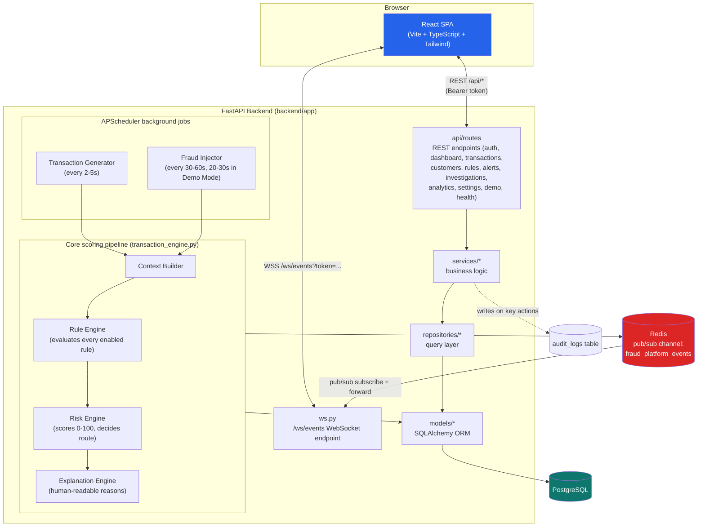

# System Architecture

## Overview

The Fraud Detection Platform is a real-time transaction monitoring and fraud
investigation system built for demonstration to banking stakeholders. It pairs a
**React single-page application** (Vite + TypeScript + Tailwind CSS) with a
**FastAPI backend** (Python), communicating over both **REST** (for all CRUD /
query operations) and a single **WebSocket** channel (for live event streaming).

The backend continuously generates realistic banking traffic and periodically
injects known fraud typologies. Every transaction — synthetic or fraudulent —
is pushed through the same rule engine, risk engine, and explanation engine
used in production-style fraud platforms, so the demo's detections are always
genuinely computed, never scripted or hand-scored.

Persistent state lives in **PostgreSQL** (via SQLAlchemy ORM). **Redis** is
used purely as a pub/sub transport to fan real-time events out to connected
browsers — it holds no durable state.

## Architecture Diagram



## Frontend

- **Stack**: React 18 + TypeScript, built with Vite 5, styled with Tailwind CSS,
  component primitives from Radix UI, charts via Recharts, data fetching via
  `@tanstack/react-query`, HTTP via Axios.
- **Pages** (`frontend/src/pages/`): Login, Dashboard, Transactions,
  TransactionDetail, TransactionSimulator, Alerts, AlertDetail, Customers,
  CustomerDetail, Rules, Analytics.
- **API client** (`frontend/src/lib/api.ts`): a single Axios instance
  (`baseURL: "/api"`) with a request interceptor that attaches
  `Authorization: Bearer <token>` from `localStorage`, and a response
  interceptor that clears the session and redirects to `/login` on any `401`.
- **Live updates** (`frontend/src/hooks/useWebSocket.ts`): a `useLiveEvents`
  hook opens a `WebSocket` to `/ws/events?token=<auth_token>`, parses each
  incoming JSON message, and dispatches it to a caller-supplied handler. It
  auto-reconnects three seconds after any disconnect.
- **Dev proxy** (`frontend/vite.config.ts`): in local development, Vite proxies
  `/api` and `/ws` to `http://localhost:8000` / `ws://localhost:8000`, so the
  SPA and API can be developed against the same relative paths used in
  production.

## Backend Layering

`backend/app/` follows a clean, single-direction dependency layering:

```
api/routes/  ->  schemas/  ->  services/  ->  repositories/  ->  models/
                                    |
                                    v
                                 utils/
```

- **`api/routes/`** — the HTTP/WebSocket boundary. Each module (`auth.py`,
  `dashboard.py`, `transactions.py`, `customers.py`, `rules.py`, `alerts.py`,
  `investigations.py`, `analytics.py`, `settings.py`, `demo.py`, `health.py`,
  `ws.py`) defines a FastAPI `APIRouter`, validates input against a Pydantic
  schema, delegates to a service, and returns a schema-typed response. Routes
  contain no query or scoring logic themselves.
- **`schemas/`** — Pydantic DTOs (`alert.py`, `analytics.py`, `auth.py`,
  `customer.py`, `dashboard.py`, `demo.py`, `rule.py`, `transaction.py`) that
  define the exact request/response contracts exposed over REST, decoupled
  from the internal ORM models.
- **`services/`** — business logic: the transaction/risk/rule/explanation
  pipeline (`transaction_engine.py`, `rule_engine.py`, `risk_engine.py`,
  `explanation_engine.py`, `context_builder.py`), the background generators
  (`transaction_generator.py`, `fraud_injector.py`), auth (`auth_service.py`),
  the Redis pub/sub wrapper (`event_bus.py`), and read-side aggregation
  (`dashboard_service.py`, `analytics_service.py`, `report_service.py`).
- **`repositories/`** — the query layer (`transaction_repo.py`,
  `alert_repo.py`, `customer_repo.py`, `rule_repo.py`). Repositories own all
  SQLAlchemy query construction (filtering, pagination, eager loading via
  `joinedload`) so services stay free of raw ORM query code.
- **`models/`** — SQLAlchemy ORM entities, one file per table (see
  `docs/DATABASE_SCHEMA.md` for the full schema).
- **`utils/`** — cross-cutting helpers: `security.py` (password hashing,
  token generation), `time.py` (UTC clock), `geo.py` (haversine distance for
  impossible-travel detection), `logger.py` (structured logging setup).

## Background Jobs (APScheduler)

Both background jobs are driven by a single `BackgroundScheduler`
(`backend/app/scheduler.py`), started from the FastAPI lifespan handler. Rather
than APScheduler's `IntervalTrigger` (which only supports fixed intervals),
each job is a **self-rescheduling one-shot job**: it runs once via a
`DateTrigger`, and on completion schedules its own next run after a randomized
delay. This produces organic, non-metronomic timing.

### Transaction Generator (`backend/app/services/transaction_generator.py`)

Fires every **2-5 seconds** (`TXN_MIN_INTERVAL_SECONDS` / `TXN_MAX_INTERVAL_SECONDS`
in `app/config.py`). Each run:

1. Picks a random active customer and one of their accounts.
2. Chooses a transaction type by weighted random draw (UPI 40%, Debit Card
   20%, Credit Card 12%, ATM 10%, IMPS 10%, NEFT 5%, RTGS 3%).
3. Derives a plausible amount from the customer's historical average.
4. Picks a known device 92% of the time (else a brand-new device UID), a
   merchant for card/UPI transactions, or a known beneficiary for transfers.
5. Occasionally (5% of the time) places the transaction in a different Indian
   city to simulate travel.
6. Feeds the resulting `ProposedTransaction` into the same `TransactionEngine`
   used for fraud, with `is_fraud_injected=False`.

### Fraud Injector (`backend/app/services/fraud_injector.py`)

Fires every **30-60 seconds** normally, or **20-30 seconds** in **Demo Mode**
(see `backend/app/scheduler.py`: `DEMO_MODE_FRAUD_INTERVAL_SECONDS = (20, 30)`,
toggled via `set_demo_mode()` / read via `is_demo_mode()`, exposed through the
Settings page and the Transaction Simulator's Demo Mode switch). Each run picks
one of 17 fraud scenario generators at random (large transactions, new-device
logins, foreign-location and impossible-travel patterns, velocity bursts, ATM
cash-out attacks, new-beneficiary/money-mule fan-out, blacklisted merchants/IPs,
dormant-account reactivation, repeated failed logins, multiple cards on one IP,
account takeover, round-number laundering, structuring, and transaction
splitting) and constructs one or more deliberately suspicious transactions.
Critically, these are **not hand-scored** — every injected transaction is run
through the identical `TransactionEngine.process()` pipeline as organic
traffic, with `is_fraud_injected=True` and a `fraud_scenario` label attached
for analytics, so detection is always genuine. A curated subset of these
scenarios is also exposed as one-click, presenter-facing triggers
(`DEMO_SCENARIOS` / `run_demo_scenario()`) from the Transaction Simulator page.

## Detection Pipeline

`TransactionEngine.process()` (`backend/app/services/transaction_engine.py`) is
the single entry point used by both the organic generator and the fraud
injector:

1. **Context Builder** (`context_builder.py`) queries current DB state (device
   history, recent transaction velocity, beneficiary history, blacklists,
   geolocation of the customer's last transaction, dormancy, failed logins) to
   build a `TransactionContext` snapshot.
2. **Rule Engine** (`rule_engine.py`) evaluates **every enabled rule** against
   that context — not just the ones that fire — so the UI can render a live,
   full pass/fail checklist. Rules cover amount anomalies, new devices,
   foreign-country/impossible-travel geovelocity, transaction velocity bursts,
   new beneficiaries, blacklisted merchants/IPs, dormant-account reactivation,
   round-number laundering, structuring, multiple-cards-per-IP, odd-hour
   activity, account-takeover combinations, repeated failed logins, and
   transaction splitting.
3. **Risk Engine** (`risk_engine.py`) sums the weights of triggered rules into
   a 0-100 score and maps it to a decision via fixed thresholds: `<=30` Approve,
   `<=60` Review, `<=80` OTP Verification, `<=100` Block.
4. **Explanation Engine** (`explanation_engine.py`) turns the triggered rules
   into a ranked, human-readable list of reasons and a one-line summary
   (e.g. *"Blocked because ... Total Risk Score 92."*).
5. The resulting `Transaction` (and a `FraudAlert` if the decision is not
   `APPROVE`) is persisted, and both are published to Redis for real-time
   delivery to the UI.

## Real-Time Streaming (No Polling)

The platform never polls the API for new transactions or alerts — everything
is pushed the instant it is scored:

1. `TransactionEngine.process()` calls `publish_event()`
   (`backend/app/services/event_bus.py`) immediately after committing a
   transaction (and alert, if any), publishing a JSON message
   (`{"type": "transaction.created" | "alert.created", "payload": {...}}`) to
   the Redis channel `fraud_platform_events`.
2. Because the scheduler jobs run synchronously (via `redis.Redis`), while
   WebSocket clients are async, `event_bus.py` exposes both a cached sync
   client (`get_sync_redis`) and a cached async client (`get_async_redis`) —
   the sync producer and async consumer share the same Redis pub/sub channel.
3. The FastAPI WebSocket endpoint `/ws/events` (`backend/app/api/routes/ws.py`)
   authenticates the connection using a `token` query parameter, then
   subscribes to the same channel and forwards every message verbatim to the
   browser over the open socket, until the client disconnects.
4. The frontend's `useLiveEvents` hook consumes these messages directly and
   updates React state / query caches in place — the Dashboard, Transactions
   feed, Alerts feed, and Transaction Simulator all reflect new activity
   within milliseconds of it happening, with automatic reconnect on drop.

This design also means the pub/sub layer is a "thin" abstraction, callable via
a stable `publish_event()` / subscribe interface that could later be swapped
for a message broker like Kafka without touching the producers or the
WebSocket endpoint.

## Authentication

Authentication is **bearer session tokens**, not JWTs. There is no signing,
encoding, or claim verification — sessions are opaque, random tokens whose
validity is checked against server-side state on every request.

- **Login** (`POST /api/auth/login`, handled by `auth_service.login()` in
  `backend/app/services/auth_service.py`): verifies the username/password
  (PBKDF2-HMAC-SHA256 with a per-user random salt, `backend/app/utils/security.py`),
  generates a 32-byte URL-safe random token (`secrets.token_urlsafe(32)`), and
  inserts a row into the **`sessions`** table (`app/models/user.py`) with the
  token, the username, and an `expires_at` timestamp **12 hours** in the future
  (`SESSION_TTL_HOURS = 12`). The token itself is returned to the client, which
  stores it in `localStorage`.
- **Request authentication**: every protected route depends on
  `get_current_user()` (`backend/app/api/dependencies.py`), which reads the
  `Authorization: Bearer <token>` header, strips the `Bearer ` prefix, and
  calls `resolve_token()`. `resolve_token()` looks the token up in the
  `sessions` table and rejects it if not found or if `expires_at` has already
  passed — there is no token content to decode, so a compromised token can be
  invalidated purely by deleting its row.
- **WebSocket authentication**: `/ws/events` cannot send an `Authorization`
  header, so the same token is instead passed as a `?token=` query parameter
  and validated with the identical `resolve_token()` check before the socket
  is accepted; an invalid/missing token closes the connection with code
  `4401`.
- **Logout** (`POST /api/auth/logout`) simply deletes the session row for the
  presented token, immediately invalidating it — again, no client-side
  decoding is involved since the token carries no data of its own.
- Sessions do not auto-refresh; once `expires_at` passes, the same 12-hour
  policy applies uniformly and the user must log in again.

## Application Startup

`backend/app/main.py` wires the FastAPI app around an `asynccontextmanager`
lifespan handler that runs at process startup and shutdown:

```python
async def lifespan(app: FastAPI):
    run_seed()
    start_scheduler()
    yield
    shutdown_scheduler()
```

- **`run_seed()`** (`backend/app/seed.py`) calls
  `Base.metadata.create_all(bind=engine)` to create any missing tables, then
  syncs the fraud rule catalog (`sync_rules()` — inserts new rule definitions
  and refreshes scoring fields on existing ones without touching an admin's
  enabled/disabled toggles). If no customers exist yet, it goes on to seed
  reference data: countries, ~100 Indian customer profiles (each with 1-2
  accounts, 1-2 devices, 2-6 beneficiaries), a merchant catalog including
  blacklisted merchants, blacklisted IPs, and two demo users (`admin` /
  `analyst`). This step is idempotent — it is safe to run on every startup.
- **`start_scheduler()`** (`backend/app/scheduler.py`) starts the
  `BackgroundScheduler` and kicks off the first self-rescheduling transaction
  and fraud-injection jobs described above, so live traffic begins flowing
  immediately after boot with no manual trigger required.
- On shutdown, `shutdown_scheduler()` stops the scheduler without waiting for
  in-flight jobs (`wait=False`).

CORS is configured from `app_settings.cors_origins_list`
(`CORS_ORIGINS` env var, defaulting to the local Vite dev origins), and all
feature routers (`auth`, `dashboard`, `transactions`, `customers`, `rules`,
`alerts`, `investigations`, `analytics`, `settings`, `health`, `demo`, `ws`)
are mounted directly on the `app` instance.

## Audit Logging

Key state-changing actions (e.g. investigation decisions, rule changes) are
recorded to the **`audit_logs`** table (`app/models/audit_log.py`) —
an append-only record of `entity_type`, `entity_id`, `action`, `actor`, a
JSON `details` blob, and a timestamp — giving compliance and investigators a
durable trail independent of the live transaction/alert feed. See
`docs/DATABASE_SCHEMA.md` for the exact column layout.
